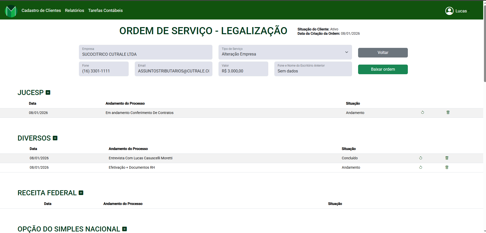

# 🧾 Sistema de Controle Contábil

## 📘 Sobre o Projeto

O **Sistema de Controle Contábil** foi desenvolvido com o objetivo de **automatizar e otimizar o gerenciamento de ordens de serviço** de uma empresa contábil.  
Antes do sistema, o controle era feito manualmente por meio de planilhas Excel, o que dificultava o acompanhamento e tornava o processo lento e suscetível a erros. Tudo isso devido ter um arquivo de excel para cada cliente, o que gerava muita confusão e perda de informações importantes.

Com esta solução, todo o processo foi **centralizado em uma aplicação web**, garantindo:
- Maior **eficiência** e **organização**;
- **Automação** no registro e acompanhamento de ordens de serviço;
- **Facilidade** no controle de andamento de processos e tarefas contábeis;
- **Melhor visualização** e **gestão** dos dados da empresa.
- **Relatórios personalizados** com visualização de faturamento.

---

## 🧠 Tecnologias Utilizadas

- **Front-end:** Angular  
- **Back-end:** .NET  
- **Banco de Dados:** SQL Server  

---

## ⚙️ Funcionalidades Principais

- Cadastro e acompanhamento de **ordens de serviço**  
- Controle de **status** (andamento, conclusão)  
- Integração entre **diferentes órgãos e processos** (Bombeiro, Conselho, Contrato de Prestação de Serviço)  
- Interface simples e responsiva para facilitar o uso  
- Controle de acesso de usuários com diferentes níveis de permissão.  
- Relatórios de faturamento e desempenho.

---

## 🔒 Código-Fonte

Por motivos de confidencialidade, o código-fonte **não está público**, pois o sistema está sendo desenvolvido para uma empresa parceira.  
Este repositório tem como objetivo apenas **apresentar o projeto** e **demonstrar sua interface e propósito**.
